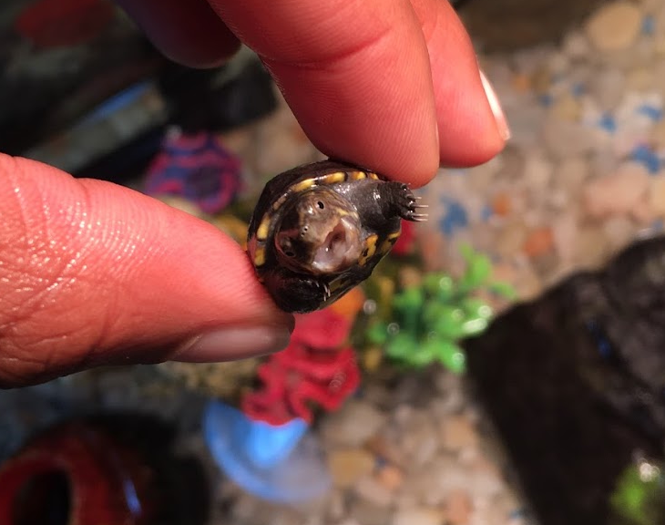
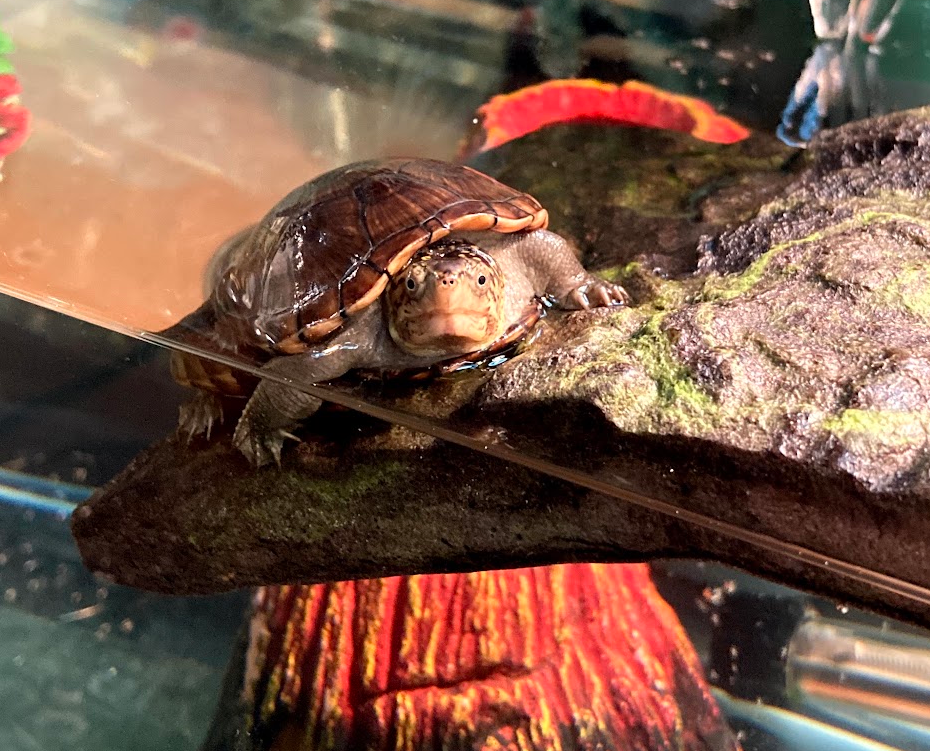
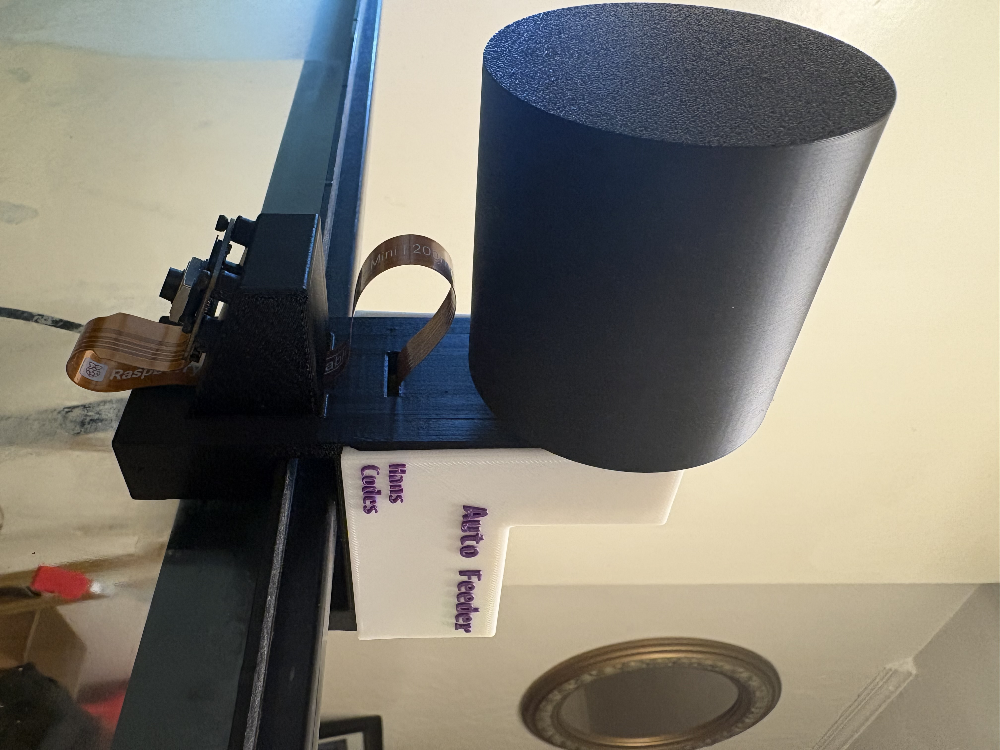
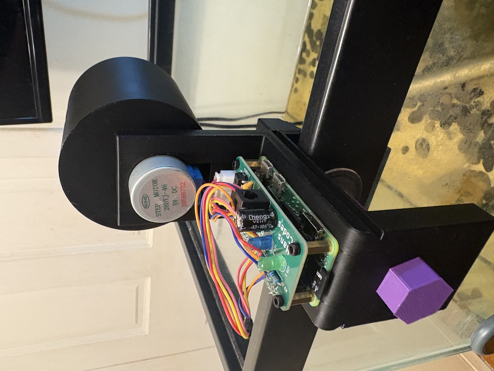

# autoFeeder

This is Clover

<div align="center" style="display: flex; flex-direction: column; align-items: center; gap: 10px; margin-bottom: 15px">
  <div style="display: flex; gap: 10px;">
    
    
  </div>
</div>

My beloved eastern mud turtle. She was given to me as a gift by my girlfriend in 2019 during our senior year of high school. Fast forward to 2026 — I've graduated college and work as a full-time software engineer, spending most of my time working from home. Since graduating I've been taking more and longer trips, and currently my mom handles feeding when I'm away. However, that won't always be the case, and when that time comes I need a solution.

autoFeeder is an automated device that not only drops food on a set schedule, but also records a video when it does and live streams a view of the tank.

<div align="center" style="display: flex; flex-direction: column; align-items: center; gap: 10px;">
  
  <div style="display: flex; gap: 10px;">
    
    
  </div>
</div>

## Demo

{video demo}

<!-- <video height="480" controls>
  <source src="media/lastFeeding.mp4" type="video/mp4">
  Your browser does not support the video tag.
</video> -->


<!--TODO: Info about background skills, and skills that are not really there yet-->

<!--TODO: Info about used resources-->

<!--TODO: Add pictures and videos of the feeder-->

## 1. System Update

```bash
sudo apt update
sudo apt upgrade
```

## 2. Camera Setup

### Verify camera is detected
```bash
dmesg | grep -i imx708
```

> Look for a line like: `imx708 10-001a: camera module ID 0x0382`
> The "fixed dependency cycle" messages are harmless.

### Install camera apps
```bash
sudo apt install -y rpicam-apps
```

### Test capture
```bash
rpicam-jpeg --output test.jpg
```
> Verify the image by pulling it off with `rsync`.

## 3. Clone the Repository

```bash
sudo apt install git
git clone https://github.com/HansChaudry/autoFeeder.git
cd autoFeeder
```

## 4. Python Virtual Environment

```bash
python -m venv venv --system-site-packages
. venv/bin/activate
```

> `--system-site-packages` allows the venv to access system packages like `picamera2`.

## 5. Install Dependencies

```bash
sudo apt install build-essential python3-dev
pip install --upgrade pip setuptools wheel
pip install -r requirements.txt
```

> If you get a `libcap` error during pip install:
> ```bash
> sudo apt install libcap-devel
> ```

## 6. Install ffmpeg

```bash
sudo apt install ffmpeg
```

## 7. Configure Environment Variables

```bash
nano .env
```

Ensure the following variables are set:

| Variable | Description |
|----------|-------------|
| `HOSTNAME` | MQTT broker hostname or IP |
| `PORT` | MQTT broker port |
| `inTopic` | MQTT topic for incoming commands |
| `streamTopic` | MQTT topic for camera stream |
| `streamURL` | Full RTSP URL e.g. `rtsp://host:port/tankCam` |

## 8. MinIO Client Setup

### Download the MinIO client binary
```bash
curl --progress-bar -L https://dl.min.io/aistor/mc/release/linux-arm64/mc \
  --create-dirs \
  -o ~/aistor-binaries/mc
```

### Make it executable
```bash
chmod +x ~/aistor-binaries/mc
```

### Set up an alias for your MinIO/AIStor instance
```bash
mc alias set hansololabMinio <url> <username> <password>
```

> Verify with `~/aistor-binaries/mc alias list`

### Create the media directory for recordings
```bash
mkdir -p /home/clover/autoFeeder/media
```

## 9. MediaMTX Streaming

The Pi streams to a MediaMTX instance running on the homelab server via RTSP. MediaMTX then serves the stream over HLS for the client app.

### HLS playback URL (client)
```
http://<server-ip>:8888/tankCam/index.m3u8
```

### MediaMTX server config (`mediamtx.yml`)
```yaml
logLevel: info
api: yes
apiAddress: :9997
rtsp: yes
rtspAddress: :8554
hls: yes
hlsAlwaysRemux: yes
hlsAddress: :8888
webrtc: yes
webrtcAddress: :8889
rtspTransports: [tcp, udp]
paths:
  tankCam:
    source: publisher
```

> Make sure UFW allows port `8554` (RTSP) and `8888` (HLS) from your local network.

## 10. n8n Automation & Discord Notifications

Two n8n workflows handle automated feeding and notifications:

**Workflow 1 — Scheduled Feeding**
- Cron trigger → publish MQTT message to `inTopic`
- Discord notification: "Feeding triggered"

**Workflow 2 — Feeding Confirmation**
- MQTT trigger on `inTopic/done`
- Discord notification: "Feeding complete"

## 11. Run the Application

```bash
python main.py
```

### Expected output
```
Press CTRL+C to exit...
Connected to broker!
Message received on topic: <inTopic>
feeding
Stream started successfully
Recording started successfully
...Feeding.mp4: ████████████████████████████████ 100.0%
Stopping stream. PID: XXXX
Stream stopped successfully
Feeding done published
```

## Architecture Overview

```
n8n (schedule)
    → MQTT publish → Pi Zero 2W
                        → stepper motor rotates drum → food drops
                        → rpicam-vid + ffmpeg → RTSP → MediaMTX
                        → ffmpeg records from RTSP → lastFeeding.mp4
                        → mc uploads to MinIO
                        → MQTT publish done message
                            → n8n → Discord notification
Client App (Expo)
    → MQTT subscribe (feed trigger)
    → HLS stream from MediaMTX
    → Display the recording from the last feeding
```